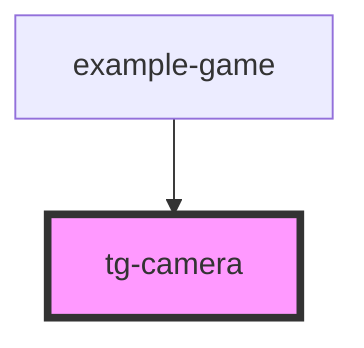

# tg-camera

<!-- Auto Generated Below -->

## Properties

| Property      | Attribute      | Description | Type          | Default     |
| ------------- | -------------- | ----------- | ------------- | ----------- |
| `followSpeed` | `follow-speed` |             | `number`      | `0.1`       |
| `height`      | `height`       |             | `number`      | `undefined` |
| `target`      | --             |             | `HTMLElement` | `null`      |
| `width`       | `width`        |             | `number`      | `undefined` |

## Dependencies

### Used by

 - [example-game](../../example/example-game)

### Graph

----------------------------------------------

*Built with [StencilJS](https://stenciljs.com/)*
