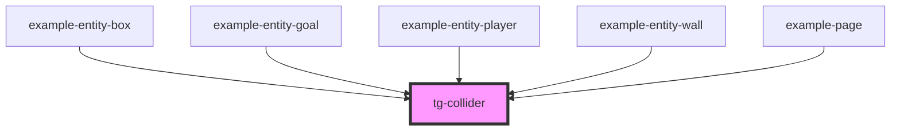

# tg-collider

<!-- Auto Generated Below -->

## Properties

| Property     | Attribute     | Description | Type      | Default               |
| ------------ | ------------- | ----------- | --------- | --------------------- |
| `debug`      | `debug`       |             | `boolean` | `false`               |
| `debugColor` | `debug-color` |             | `string`  | `'rgba(255,0,0,0.5)'` |
| `group`      | `group`       |             | `string`  | `"default"`           |
| `height`     | `height`      |             | `number`  | `0`                   |
| `name`       | `name`        |             | `string`  | `"default"`           |
| `offsetX`    | `offset-x`    |             | `number`  | `0`                   |
| `offsetY`    | `offset-y`    |             | `number`  | `0`                   |
| `scale`      | `scale`       |             | `number`  | `1`                   |
| `type`       | `type`        |             | `string`  | `"default"`           |
| `width`      | `width`       |             | `number`  | `0`                   |
| `x`          | `x`           |             | `number`  | `0`                   |
| `y`          | `y`           |             | `number`  | `0`                   |

## Events

| Event       | Description | Type                     |
| ----------- | ----------- | ------------------------ |
| `collision` |             | `CustomEvent<ICollider>` |

## Methods

### `checkCollisionOnPosition(x: number, y: number, width: number, height: number) => Promise<HTMLTgColliderElement | null>`

#### Parameters

| Name     | Type     | Description |
| -------- | -------- | ----------- |
| `x`      | `number` |             |
| `y`      | `number` |             |
| `width`  | `number` |             |
| `height` | `number` |             |

#### Returns

Type: `Promise<HTMLTgColliderElement>`

## Dependencies

### Used by

 - [example-entity-box](../../example/example-game/entities/entity-box)
 - [example-entity-goal](../../example/example-game/entities/entity-goal)
 - [example-entity-player](../../example/example-game/entities/entity-player)
 - [example-entity-wall](../../example/example-game/entities/entity-wall)
 - [example-page](../../example/example-page)

### Graph

----------------------------------------------

*Built with [StencilJS](https://stenciljs.com/)*
