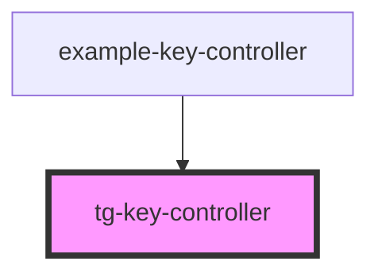

# tg-key-controller

<!-- Auto Generated Below -->

## Properties

| Property | Attribute | Description                                                                                      | Type       | Default |
| -------- | --------- | ------------------------------------------------------------------------------------------------ | ---------- | ------- |
| `keys`   | `keys`    | Array of keys to be monitored. e.g. ['ArrowUp', 'ArrowDown', 'ArrowLeft', 'ArrowRight', 'Space'] | `string[]` | `[]`    |

## Events

| Event          | Description                                    | Type                  |
| -------------- | ---------------------------------------------- | --------------------- |
| `pressKeyDown` | Event emitted when a monitored key is pressed  | `CustomEvent<string>` |
| `pressKeyUp`   | Event emitted when a monitored key is released | `CustomEvent<string>` |

## Dependencies

### Used by

 - [example-key-controller](../../example/example-key-controller)

### Graph

----------------------------------------------

*Built with [StencilJS](https://stenciljs.com/)*
