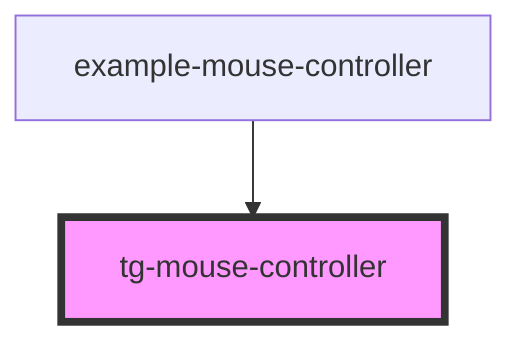

# tg-mouse-controller

<!-- Auto Generated Below -->

## Events

| Event              | Description | Type                                               |
| ------------------ | ----------- | -------------------------------------------------- |
| `mouseButton1Down` |             | `CustomEvent<void>`                                |
| `mouseButton1Up`   |             | `CustomEvent<void>`                                |
| `mouseButton2Down` |             | `CustomEvent<void>`                                |
| `mouseButton2Up`   |             | `CustomEvent<void>`                                |
| `mouseRotation`    |             | `CustomEvent<{ deltaX: number; deltaY: number; }>` |

## Dependencies

### Used by

 - [example-mouse-controller](../../example/example-mouse-controller)

### Graph

----------------------------------------------

*Built with [StencilJS](https://stenciljs.com/)*
