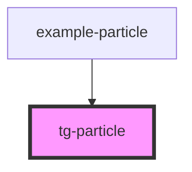

# tg-particle

A particle system component for creating effects like explosions, fire, smoke, and other visual effects using sprites.

<!-- Auto Generated Below -->

## Properties

| Property  | Attribute  | Description | Type              | Default                                                                                                                                                                                                                                                                                                                                                                                                                                                  |
| --------- | ---------- | ----------- | ----------------- | -------------------------------------------------------------------------------------------------------------------------------------------------------------------------------------------------------------------------------------------------------------------------------------------------------------------------------------------------------------------------------------------------------------------------------------------------------- |
| `config`  | `config`   |             | `IParticleConfig` | `{     count: 50,     emissionRate: 10,     life: 2000,     lifeVariation: 500,     velocity: { x: 0, y: -50 },     velocityVariation: { x: 30, y: 20 },     acceleration: { x: 0, y: 0 },     accelerationVariation: { x: 0, y: 0 },     size: 1,     sizeVariation: 0.5,     rotation: 0,     rotationSpeed: 0,     rotationSpeedVariation: 2,     alpha: 1,     alphaDecay: 0.02,     spread: 45,     gravity: { x: 0, y: 20 },     burst: false   }` |
| `hFrames` | `h-frames` |             | `number`          | `1`                                                                                                                                                                                                                                                                                                                                                                                                                                                      |
| `height`  | `height`   |             | `number`          | `16`                                                                                                                                                                                                                                                                                                                                                                                                                                                     |
| `loop`    | `loop`     |             | `boolean`         | `false`                                                                                                                                                                                                                                                                                                                                                                                                                                                  |
| `playing` | `playing`  |             | `boolean`         | `false`                                                                                                                                                                                                                                                                                                                                                                                                                                                  |
| `scale`   | `scale`    |             | `number`          | `1`                                                                                                                                                                                                                                                                                                                                                                                                                                                      |
| `src`     | `src`      |             | `string`          | `undefined`                                                                                                                                                                                                                                                                                                                                                                                                                                              |
| `vFrames` | `v-frames` |             | `number`          | `1`                                                                                                                                                                                                                                                                                                                                                                                                                                                      |
| `width`   | `width`    |             | `number`          | `16`                                                                                                                                                                                                                                                                                                                                                                                                                                                     |

## Dependencies

### Used by

 - [example-particle](../../example/example-particle)

### Graph

----------------------------------------------

*Built with [StencilJS](https://stenciljs.com/)*
