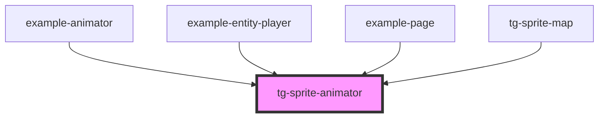

# tg-sprite-animator

<!-- Auto Generated Below -->

## Overview

Component to animate a tg-sprite component using a animation object
It takes in the following properties:

## Properties

| Property         | Attribute         | Description                                        | Type                             | Default      |
| ---------------- | ----------------- | -------------------------------------------------- | -------------------------------- | ------------ |
| `animations`     | `animations`      | the animations to be played                        | `{ [key: string]: IAnimation; }` | `null`       |
| `iterationCount` | `iteration-count` | the number of times the animation should be played | `"infinite" \| number`           | `'infinite'` |
| `play`           | `play`            | the animation to play                              | `string`                         | `null`       |
| `state`          | `state`           | the state of the animation                         | `"paused" \| "running"`          | `'running'`  |

## Methods

### `refresh() => Promise<string>`

trigger if the sprite component hast changed props
that used for animation like scale

#### Returns

Type: `Promise<string>`

## Dependencies

### Used by

 - [example-animator](../../example/example-animator)
 - [example-entity-player](../../example/example-game/entities/entity-player)
 - [example-page](../../example/example-page)
 - [tg-sprite-map](../tg-sprite-map)

### Graph

----------------------------------------------

*Built with [StencilJS](https://stenciljs.com/)*
