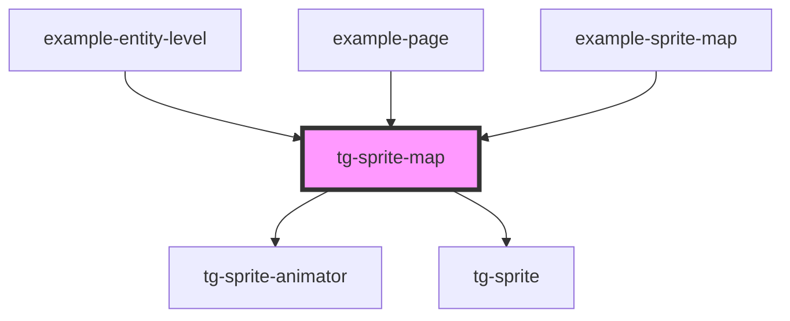

# tg-sprite-map

<!-- Auto Generated Below -->

## Properties

| Property     | Attribute     | Description | Type      | Default |
| ------------ | ------------- | ----------- | --------- | ------- |
| `hFrames`    | `h-frames`    |             | `number`  | `1`     |
| `height`     | `height`      |             | `number`  | `5`     |
| `scale`      | `scale`       |             | `number`  | `1`     |
| `src`        | `src`         |             | `string`  | `''`    |
| `tileHeight` | `tile-height` |             | `number`  | `16`    |
| `tileWidth`  | `tile-width`  |             | `number`  | `16`    |
| `tiles`      | --            |             | `ITile[]` | `[]`    |
| `vFrames`    | `v-frames`    |             | `number`  | `1`     |
| `width`      | `width`       |             | `number`  | `5`     |

## Dependencies

### Used by

 - [example-entity-level](../../example/example-game/entities/entity-level)
 - [example-page](../../example/example-page)
 - [example-sprite-map](../../example/example-sprite-map)

### Depends on

- [tg-sprite-animator](../tg-sprite-animator)
- [tg-sprite](../tg-sprite)

### Graph

----------------------------------------------

*Built with [StencilJS](https://stenciljs.com/)*
