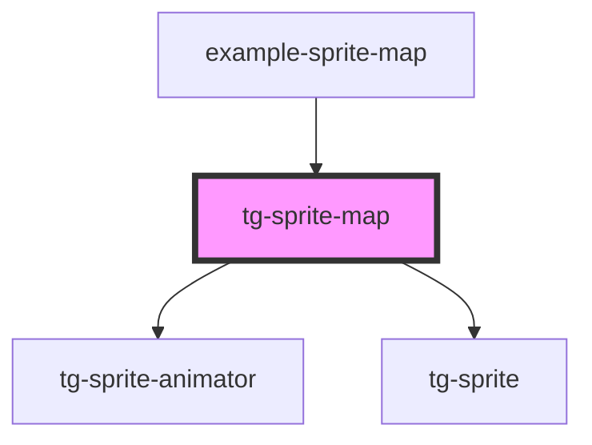

# tg-sprite-map

<!-- Auto Generated Below -->

## Properties

| Property  | Attribute  | Description | Type      | Default |
| --------- | ---------- | ----------- | --------- | ------- |
| `hFrames` | `h-frames` |             | `number`  | `1`     |
| `height`  | `height`   |             | `number`  | `16`    |
| `scale`   | `scale`    |             | `number`  | `1`     |
| `src`     | `src`      |             | `string`  | `''`    |
| `tiles`   | --         |             | `ITile[]` | `[]`    |
| `vFrames` | `v-frames` |             | `number`  | `1`     |
| `width`   | `width`    |             | `number`  | `16`    |

## Dependencies

### Used by

 - [example-sprite-map](../../example/example-sprite-map)

### Depends on

- [tg-sprite-animator](../tg-sprite-animator)
- [tg-sprite](../tg-sprite)

### Graph

----------------------------------------------

*Built with [StencilJS](https://stenciljs.com/)*
