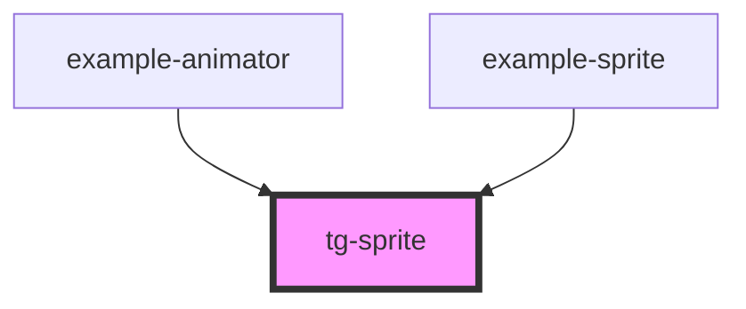

# tg-sprite

<!-- Auto Generated Below -->

## Overview

a component that can be used to display a sprite sheet image in a game or animation scene
It takes in the following properties:

## Properties

| Property  | Attribute  | Description                                   | Type      | Default |
| --------- | ---------- | --------------------------------------------- | --------- | ------- |
| `frame`   | `frame`    | the frame of the sprite image                 | `number`  | `0`     |
| `hFlip`   | `h-flip`   | whether to flip the sprite image horizontally | `boolean` | `false` |
| `hFrames` | `h-frames` | the number of horizontal frames               | `number`  | `1`     |
| `height`  | `height`   | the height of the sprite image                | `number`  | `16`    |
| `scale`   | `scale`    | the scale of the sprite image                 | `number`  | `1`     |
| `src`     | `src`      | the source of the sprite image                | `string`  | `null`  |
| `vFlip`   | `v-flip`   | whether to flip the sprite image vertically   | `boolean` | `false` |
| `vFrames` | `v-frames` | the number of vertical frames                 | `number`  | `1`     |
| `width`   | `width`    | the width of the sprite image                 | `number`  | `16`    |

## Dependencies

### Used by

 - [example-animator](../../example/example-animator)
 - [example-sprite](../../example/example-sprite)

### Graph

----------------------------------------------

*Built with [StencilJS](https://stenciljs.com/)*
