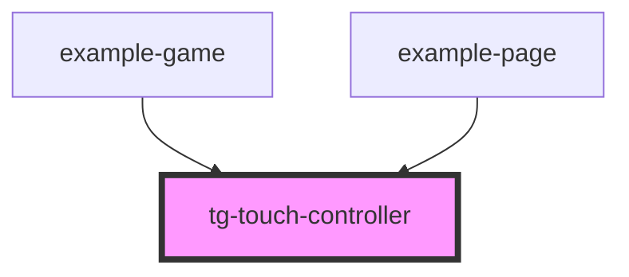

# tg-touch-controller

<!-- Auto Generated Below -->

## Properties

| Property    | Attribute   | Description                                                                                                                         | Type     | Default |
| ----------- | ----------- | ----------------------------------------------------------------------------------------------------------------------------------- | -------- | ------- |
| `threshold` | `threshold` | Minimum distance in pixels required to trigger a swipe gesture. Lower values make the controller more sensitive to small movements. | `number` | `20`    |

## Events

| Event        | Description | Type                |
| ------------ | ----------- | ------------------- |
| `swipeDown`  |             | `CustomEvent<void>` |
| `swipeLeft`  |             | `CustomEvent<void>` |
| `swipeRight` |             | `CustomEvent<void>` |
| `swipeUp`    |             | `CustomEvent<void>` |

## Dependencies

### Used by

 - [example-game](../../example/example-game)
 - [example-page](../../example/example-page)

### Graph

----------------------------------------------

*Built with [StencilJS](https://stenciljs.com/)*
