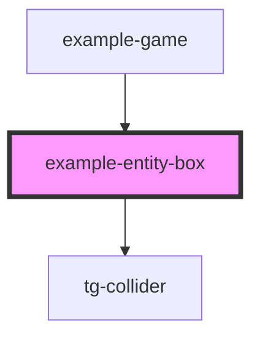

# entity-box

<!-- Auto Generated Below -->

## Properties

| Property | Attribute | Description | Type       | Default             |
| -------- | --------- | ----------- | ---------- | ------------------- |
| `vector` | `vector`  |             | `IVector2` | `new Vector2(0, 0)` |

## Dependencies

### Used by

 - [example-game](../..)

### Depends on

- [tg-collider](../../../../engine/tg-collider)

### Graph

----------------------------------------------

*Built with [StencilJS](https://stenciljs.com/)*
