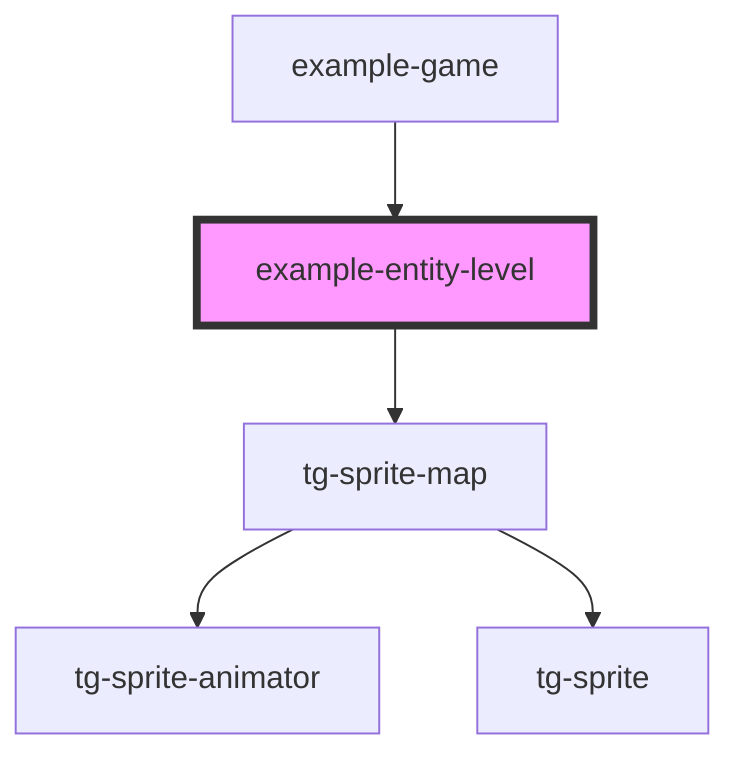

# entity-level

<!-- Auto Generated Below -->

## Dependencies

### Used by

 - [example-game](../..)

### Depends on

- [tg-sprite-map](../../../../engine/tg-sprite-map)

### Graph

----------------------------------------------

*Built with [StencilJS](https://stenciljs.com/)*
