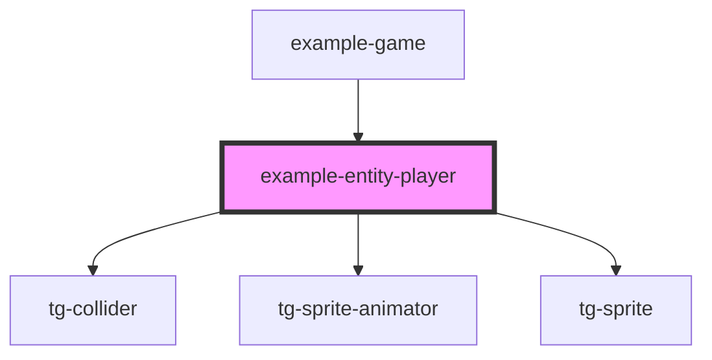

# entity-player

<!-- Auto Generated Below -->

## Properties

| Property    | Attribute   | Description | Type                                  | Default             |
| ----------- | ----------- | ----------- | ------------------------------------- | ------------------- |
| `direction` | `direction` |             | `"down" \| "left" \| "right" \| "up"` | `'down'`            |
| `type`      | `type`      |             | `"idle" \| "walk"`                    | `'walk'`            |
| `vector`    | `vector`    |             | `IVector2`                            | `new Vector2(0, 0)` |

## Events

| Event        | Description | Type                   |
| ------------ | ----------- | ---------------------- |
| `transition` |             | `CustomEvent<boolean>` |

## Methods

### `flipH() => Promise<void>`

#### Returns

Type: `Promise<void>`

### `flipV() => Promise<void>`

#### Returns

Type: `Promise<void>`

### `getCollider() => Promise<HTMLTgColliderElement>`

#### Returns

Type: `Promise<HTMLTgColliderElement>`

### `playAnimation(type: "idle" | "walk") => Promise<void>`

#### Parameters

| Name   | Type               | Description |
| ------ | ------------------ | ----------- |
| `type` | `"idle" \| "walk"` |             |

#### Returns

Type: `Promise<void>`

## Dependencies

### Used by

 - [example-game](../..)

### Depends on

- [tg-collider](../../../../engine/tg-collider)
- [tg-sprite-animator](../../../../engine/tg-sprite-animator)
- [tg-sprite](../../../../engine/tg-sprite)

### Graph

----------------------------------------------

*Built with [StencilJS](https://stenciljs.com/)*
