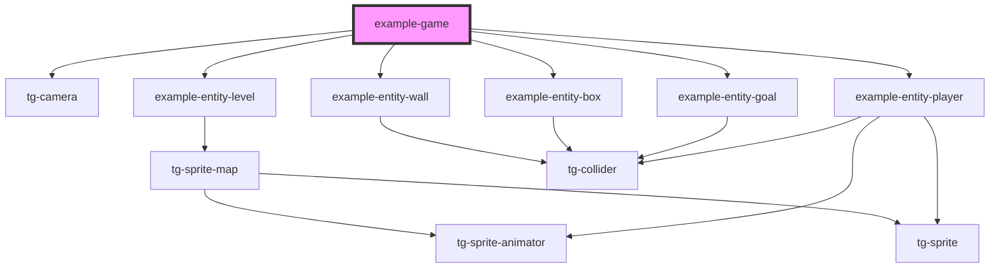

# example-engine

<!-- Auto Generated Below -->

## Dependencies

### Depends on

- [tg-camera](../../engine/tg-camera)
- [example-entity-level](./entities/entity-level)
- [example-entity-wall](./entities/entity-wall)
- [example-entity-box](./entities/entity-box)
- [example-entity-goal](./entities/entity-goal)
- [example-entity-player](./entities/entity-player)

### Graph

----------------------------------------------

*Built with [StencilJS](https://stenciljs.com/)*
