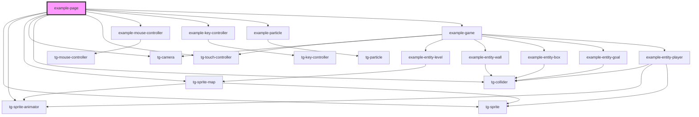

# example-page

<!-- Auto Generated Below -->

## Dependencies

### Depends on

- [tg-sprite](../../engine/tg-sprite)
- [tg-sprite-animator](../../engine/tg-sprite-animator)
- [tg-sprite-map](../../engine/tg-sprite-map)
- [tg-camera](../../engine/tg-camera)
- [tg-collider](../../engine/tg-collider)
- [tg-touch-controller](../../engine/tg-touch-controller)
- [example-mouse-controller](../example-mouse-controller)
- [example-key-controller](../example-key-controller)
- [example-particle](../example-particle)
- [example-game](../example-game)

### Graph

----------------------------------------------

*Built with [StencilJS](https://stenciljs.com/)*
