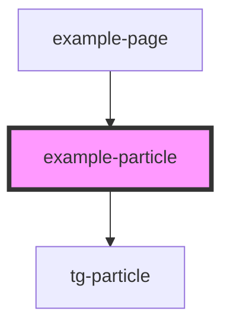

# example-particle

Example component demonstrating the TG Particle System with different effect types including explosions, fire, and smoke effects.

<!-- Auto Generated Below -->

## Dependencies

### Used by

 - [example-page](../example-page)

### Depends on

- [tg-particle](../../engine/tg-particle)

### Graph

----------------------------------------------

*Built with [StencilJS](https://stenciljs.com/)*
